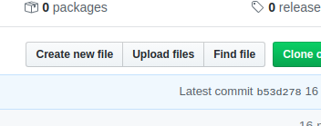
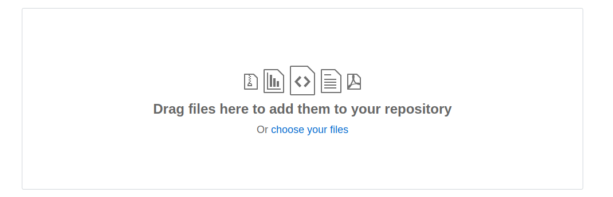
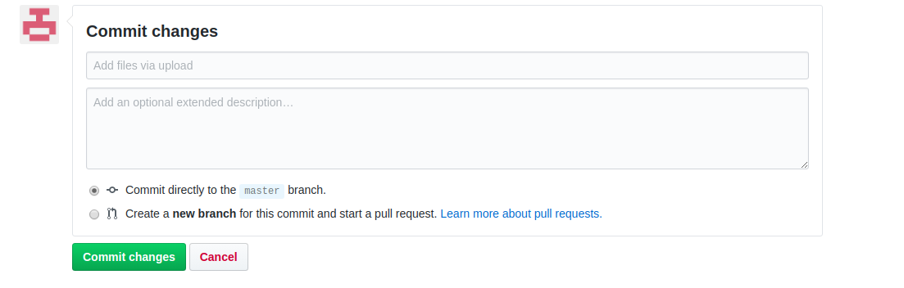

# Math Is Logic and Fun
stii deja despre ce e vorba :)
## Cum adaugi fisiere
1) Apasa pe _Upload files_     
  
2) Alege-ti fiserul (_Choose your files_)  
  
3) Adauga un titlu scurt si sugestiv (ex. _Added foo.xlsx_) si apoi apasa _Commit changes_  
  
## N.B.
#### Pentru a pastra structura repo-ului, adauga fisierele in folderul _src_ (care vine de la source)
